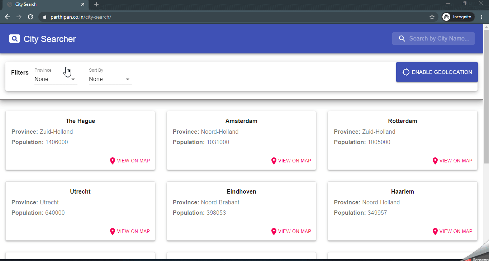
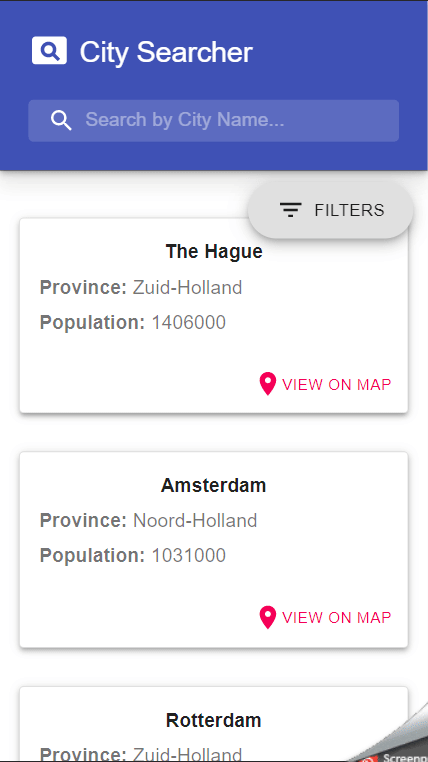

## City Searcher

A quick PoC built with React, Material UI, Typescript, webpack, AWS lambda and AWS API Gateway.

### Deployed App

The live version of the app is available [here]("https://parthipan.co.in/city-search)

### Features

- Search by name.
- Filter by province.
- Apply any one of the sorting at a time: sort by city name, population, distance from the user.
- Smooth UI on both desktop and mobile.

### Screenshots

#### Desktop

#### Mobile

